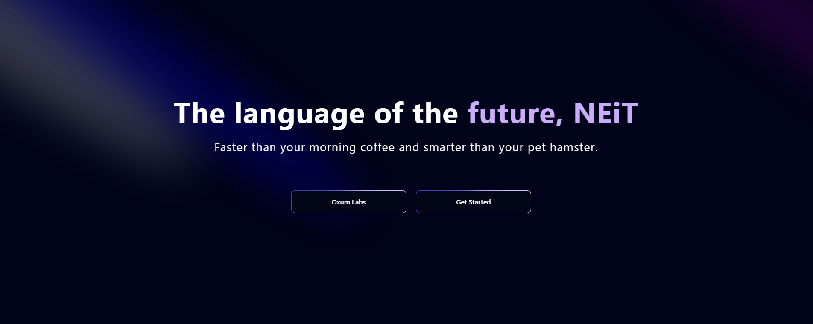

# Nsite



## Table of Contents

- [Introduction](#introduction)
- [Features](#features)
- [Installation](#installation)
- [Usage](#usage)
- [Contributing](#contributing)
- [License](#license)
- [Contact](#contact)

## Introduction

Nsite is the official webpage for the programming language **NEiT**. Built using Next.js, TypeScript, and Tailwind, the website showcases the unique features of NEiT, which is designed to offer a powerful coding experience. From the Semigen engine to a super-powered compiler and a Rust-based interpreter, NEiT aims to transform the way developers approach coding.

## Features

- **Semigen Engine**: At the heart of NEiT lies the Semigen engine, which lets you bend the language's syntax to your will.
- **Compiler**: NEiT boasts a super-powered compiler that churns out high-performance C code, using Clang for optimizations.
- **Interpreter**: A Rust-based interpreter allows you to run your code like a pro with a portable and efficient tool.
- **Artificial Intelligence**: NEiT leverages AI to craft the perfect coding environment tailored to your needs.

## Installation

To set up the project locally, follow these steps:

1. **Clone the repository:**

    ```bash
    git clone https://github.com/Hacker-Anakin/Nsite.git
    ```

2. **Navigate to the project directory:**

    ```bash
    cd Nsite
    ```

3. **Install the dependencies:**

    ```bash
    npm install
    ```

## Usage

To start the development server, run:

```bash
npm start
```

Open [http://localhost:3000](http://localhost:3000) in your browser to view and interact with Nsite.

## Contributing

We welcome contributions to improve Nsite. To contribute:

1. Fork the repository.
2. Create a new branch (`git checkout -b feature/your-feature`).
3. Commit your changes (`git commit -m 'Add your feature'`).
4. Push to the branch (`git push origin feature/your-feature`).
5. Open a Pull Request.

## License

This project is licensed under the MIT License. See the [LICENSE](LICENSE) file for details.

## Contact

For any questions or feedback, please contact us at [oxumlabs@proton.me](mailto:oxumlabs@proton.me).

---

Feel free to make any changes or provide further information!
